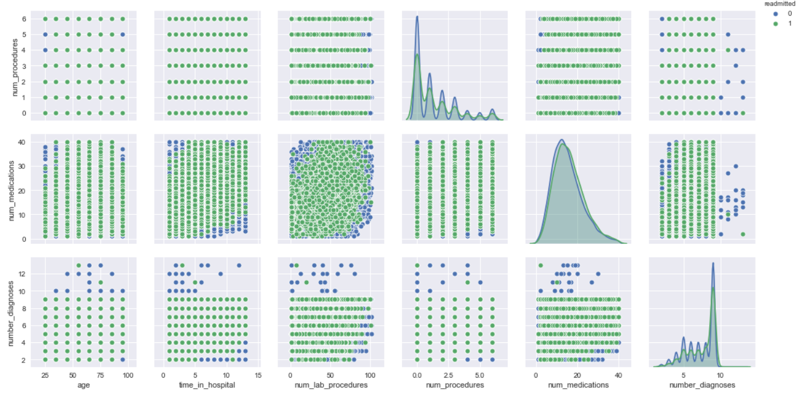
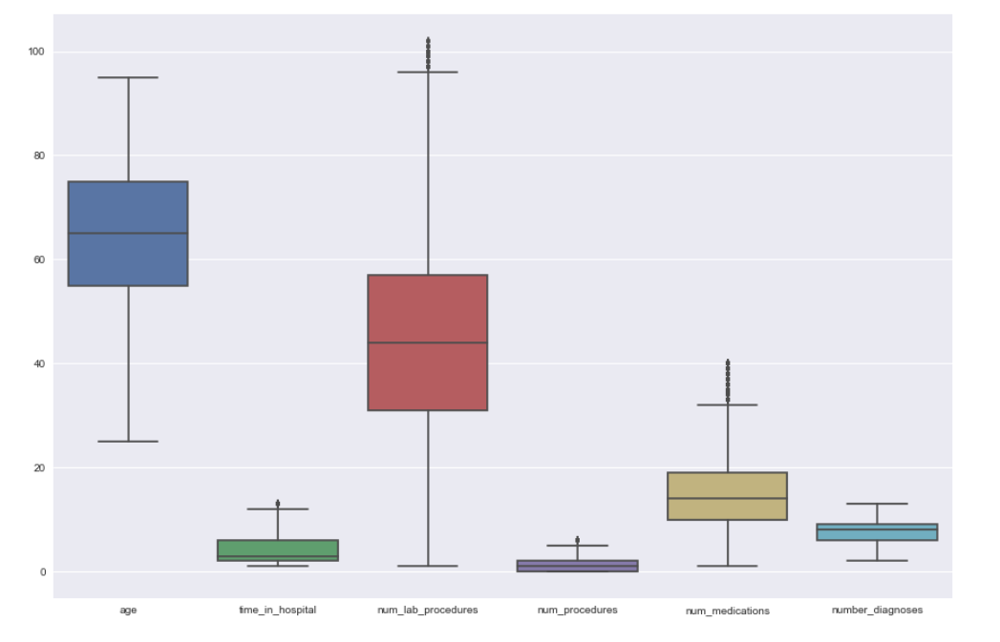
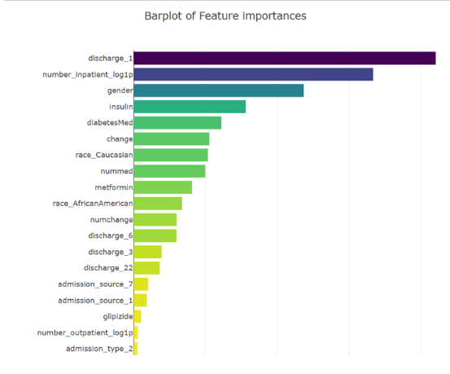

Analysis of Healthcare da


[](https://choosealicense.com/licenses/mit)
[](http://hits.dwyl.io/ashish1993utd/HealthCare-Data-Challenge)

# HealthCare-Data-Challenge
> Analysis of a Healthcare data to predict whether a patient will be readmitted to the hospital or not. 
The project was completed as a part of Healthcare Data Challenge organized at the University of Texas at Dallas.

## Table of contents
* [General info](#general-info)
* [Screenshots](#screenshots)
* [Technologies and Tools](#technologies-and-tools)
* [Code Examples](#code-examples)
* [Status](#status)
* [Contact](#contact)

## General info

It is a problem of supervised learning - A binary classification problem. The steps involved were data cleaning, preprocessing, feature engineering, data balancing, model building, model evaluation and model selection.

## Screenshots






## Technologies and Tools
* Python 
* Scikit-learn

## Code Examples

````
# Feature Engineering

keys = ['metformin', 'repaglinide', 'nateglinide', 'chlorpropamide', 'glimepiride', 'acetohexamide', 'glipizide', 
        'glyburide', 'tolbutamide', 'pioglitazone', 'rosiglitazone', 'acarbose', 'miglitol', 'troglitazone', 'tolazamide', 
        'insulin', 'glyburide-metformin', 'glipizide-metformin', 'glimepiride-pioglitazone', 'metformin-rosiglitazone', 
        'metformin-pioglitazone']

for col in keys:
    colname = str(col) + 'temp'
    train[colname] = train[col].apply(lambda x: 0 if (x == 'No' or x == 'Steady') else 1)

train['numchange'] = 0
for col in keys:
    colname = str(col) + 'temp'
    train['numchange'] = train['numchange'] + train[colname]
    del train[colname]
    
for col in keys:
    train[col] = train[col].replace('No', 0)
    train[col] = train[col].replace('Steady', 1)
    train[col] = train[col].replace('Up', 1)
    train[col] = train[col].replace('Down', 1) 

train['nummed'] = 0
for col in keys:
    train['nummed'] = train['nummed'] + train[col]
         
train['change'] = train['change'].replace('Ch', 1)
train['change'] = train['change'].replace('No', 0)
train['gender'] = train['gender'].replace('Male', 1)
train['gender'] = train['gender'].replace('Female', 0)
train['diabetesMed'] = train['diabetesMed'].replace('Yes', 1)
train['diabetesMed'] = train['diabetesMed'].replace('No', 0)

train = train.drop_duplicates(subset= ['patient_nbr'], keep = 'first')

train.drop(columns=['diag_1','diag_2','diag_3','encounter_id','patient_nbr'],axis=1, inplace=True)

age_dict = {'[0-10)':5,'[10-20)':15, '[20-30)':25, '[30-40)':35, '[40-50)':45,'[50-60)':55, '[60-70)':65, '[70-80)':75, '[80-90)':85,'[90-100)':95}
train['age'] = train.age.map(age_dict)
train['age'] = train['age'].astype('int64')

train['readmitted'] = train['readmitted'].map({'Y':1,'N':0})
train['A1Cresult'] = train['A1Cresult'].map({'None':-99,'>7':1, '>8':1, 'Norm':0})
train['max_glu_serum'] = train['max_glu_serum'].map({'None':-99,'>300':1,'>200':1,'Norm':0 })
````
````
# Correcting for Skewness

num_col = ['age', 'time_in_hospital', 'num_lab_procedures',
       'num_procedures', 'num_medications', 'number_outpatient',
       'number_emergency', 'number_inpatient', 'number_diagnoses']

statdataframe = pd.DataFrame()
statdataframe['numeric_column'] = num_col

skew_before = []
skew_after = []

kurt_before = []
kurt_after = []

standard_deviation_before = []
standard_deviation_after = []

log_transform_needed = []

log_type = []

for i in num_col:
    skewval = test[i].skew()
    skew_before.append(skewval)
    
    kurtval = test[i].kurtosis()
    kurt_before.append(kurtval)
    
    sdval = test[i].std()
    standard_deviation_before.append(sdval)
    
    if (abs(skewval) >2) & (abs(kurtval) >2):
        log_transform_needed.append('Yes')
        
        if len(test[test[i] == 0])/len(test) <=0.02:
            log_type.append('log')
            skewvalnew = np.log(pd.DataFrame(test[test_data[i] > 0])[i]).skew()
            skew_after.append(skewvalnew)
            
            kurtvalnew = np.log(pd.DataFrame(test[test_data[i] > 0])[i]).kurtosis()
            kurt_after.append(kurtvalnew)
            
            sdvalnew = np.log(pd.DataFrame(test[test_data[i] > 0])[i]).std()
            standard_deviation_after.append(sdvalnew)
            
        else:
            log_type.append('log1p')
            skewvalnew = np.log1p(pd.DataFrame(test[test[i] >= 0])[i]).skew()
            skew_after.append(skewvalnew)
        
            kurtvalnew = np.log1p(pd.DataFrame(test[test[i] >= 0])[i]).kurtosis()
            kurt_after.append(kurtvalnew)
            
            sdvalnew = np.log1p(pd.DataFrame(test[test[i] >= 0])[i]).std()
            standard_deviation_after.append(sdvalnew)
            
    else:
        log_type.append('NA')
        log_transform_needed.append('No')
        
        skew_after.append(skewval)
        kurt_after.append(kurtval)
        standard_deviation_after.append(sdval)

statdataframe['skew_before'] = skew_before
statdataframe['kurtosis_before'] = kurt_before
statdataframe['standard_deviation_before'] = standard_deviation_before
statdataframe['log_transform_needed'] = log_transform_needed
statdataframe['log_type'] = log_type
statdataframe['skew_after'] = skew_after
statdataframe['kurtosis_after'] = kurt_after
statdataframe['standard_deviation_after'] = standard_deviation_after
````
````
# Data Modeling

results = pd.DataFrame(index=None, columns=['model','f1_score_train','f1_score_test','train_precision_score',
                                            'test_precision_score','train_recall_score','test_recall_score',
                                            'f_beta_score_train','f_beta_score_test'])

lreg_clf = LogisticRegression()
lreg_clf = LogisticRegression(penalty = 'l1')
lreg_clf.fit(X_train,y_train)
y_lreg_clf = lreg_clf.predict(X_test)
f1_score_train=f1_score(y_train, lreg_clf.predict(X_train))
f1_score_test=f1_score(y_test, lreg_clf.predict(X_test))
train_precision_score=precision_score(y_train,lreg_clf.predict(X_train))
test_precision_score=precision_score(y_test,lreg_clf.predict(X_test))
train_recall_score=recall_score(y_train,lreg_clf.predict(X_train))
test_recall_score=recall_score(y_test,lreg_clf.predict(X_test))
f_beta_score_train=precision_recall_fscore_support(y_train,lreg_clf.predict(X_train), beta=1.0, labels=[0,1], pos_label=1, average='weighted', warn_for=('precision', 'recall', 'f-score'), sample_weight=None)[2]
f_beta_score_test=precision_recall_fscore_support(y_test,lreg_clf.predict(X_test), beta=1.0, labels=[0,1], pos_label=1, average='weighted', warn_for=('precision', 'recall', 'f-score'), sample_weight=None)[2]
results = results.append(pd.Series({'model':'Logistic Regression','f1_score_train':f1_score_train,'f1_score_test':f1_score_test,'train_precision_score':train_precision_score,'train_recall_score':train_recall_score,
                                    'test_recall_score':test_recall_score,'test_precision_score':test_precision_score,'f_beta_score_train':f_beta_score_train,'f_beta_score_test':f_beta_score_test})
                         ,ignore_index=True )
results

rf_clf = RandomForestClassifier(bootstrap=False,max_depth=6,max_features=16,min_samples_leaf=16,min_samples_split=2)
rf_clf.fit(X_train,y_train)
y_rf_clf = rf_clf.predict(X_test)
train_precision_score=precision_score(y_train,rf_clf.predict(X_train))
test_precision_score=precision_score(y_test,rf_clf.predict(X_test))
f1_score_train=f1_score(y_train, rf_clf.predict(X_train))
f1_score_test=f1_score(y_test, rf_clf.predict(X_test))
train_recall_score=recall_score(y_train,rf_clf.predict(X_train))
test_recall_score=recall_score(y_test,rf_clf.predict(X_test))
f_beta_score_train=precision_recall_fscore_support(y_train,rf_clf.predict(X_train), beta=1.0, labels=[0,1], pos_label=1, average='weighted', warn_for=('precision', 'recall', 'f-score'), sample_weight=None)[2]
f_beta_score_test=precision_recall_fscore_support(y_test,rf_clf.predict(X_test), beta=1.0, labels=[0,1], pos_label=1, average='weighted', warn_for=('precision', 'recall', 'f-score'), sample_weight=None)[2]
results = results.append(pd.Series({'model':'Random Forest','f1_score_train':f1_score_train,'f1_score_test':f1_score_test,'train_precision_score':train_precision_score,'train_recall_score':train_recall_score,
                                    'test_recall_score':test_recall_score,'test_precision_score':test_precision_score,'f_beta_score_train':f_beta_score_train,'f_beta_score_test':f_beta_score_test})
                         ,ignore_index=True )
results
````

## Status
Project is: _finished_. 

## Contact
If you loved what you read here and feel like we can collaborate to produce some exciting stuff, or if you
just want to shoot a question, please feel free to connect with me on 
<a href="mailto:hello@sharma-ashish.com">email</a> or 
<a href="https://www.linkedin.com/in/ashishsharma1993/" target="_blank">LinkedIn</a>
